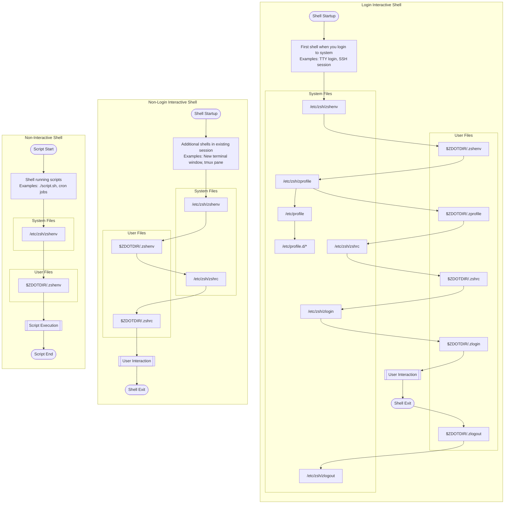

```mermaid
flowchart TB
    subgraph login["Login Interactive Shell"]
        direction TB
        loginDesc["First shell when you login to system<br>Examples: TTY login, SSH session"]
        loginStart(["Shell Startup"])
        
        subgraph lsys["System Files"]
            L1["/etc/zsh/zshenv"]
            L3["/etc/zsh/zprofile"]
            L4["/etc/profile"]
            L5["/etc/profile.d/*"]
            L7["/etc/zsh/zshrc"]
            L9["/etc/zsh/zlogin"]
            L11["/etc/zsh/zlogout"]
        end
        subgraph luser["User Files"]
            L2["$ZDOTDIR/.zshenv"]
            L6["$ZDOTDIR/.zprofile"]
            L8["$ZDOTDIR/.zshrc"]
            L10["$ZDOTDIR/.zlogin"]
            L12["$ZDOTDIR/.zlogout"]
        end
        
        loginPrompt[["User Interaction"]]
        loginEnd(["Shell Exit"])
    end

    subgraph nonlogin["Non-Login Interactive Shell"]
        direction TB
        nonloginDesc["Additional shells in existing session<br>Examples: New terminal window, tmux pane"]
        nonloginStart(["Shell Startup"])
        
        subgraph nlsys["System Files"]
            NL1["/etc/zsh/zshenv"]
            NL3["/etc/zsh/zshrc"]
        end
        subgraph nluser["User Files"]
            NL2["$ZDOTDIR/.zshenv"]
            NL4["$ZDOTDIR/.zshrc"]
        end
        
        nonloginPrompt[["User Interaction"]]
        nonloginEnd(["Shell Exit"])
    end

    subgraph script["Non-Interactive Shell"]
        direction TB
        scriptDesc["Shell running scripts<br>Examples: ./script.sh, cron jobs"]
        scriptStart(["Script Start"])
        
        subgraph ssys["System Files"]
            S1["/etc/zsh/zshenv"]
        end
        subgraph suser["User Files"]
            S2["$ZDOTDIR/.zshenv"]
        end
        
        scriptRun[["Script Execution"]]
        scriptEnd(["Script End"])
    end

    %% Login shell flow
    loginStart --> loginDesc
    loginDesc --> L1 --> L2 --> L3
    L3 --> L4
    L4 --> L5
    L3 --> L6
    L6 --> L7 --> L8 --> L9 --> L10 --> loginPrompt
    loginPrompt --> loginEnd
    loginEnd --> L12 --> L11

    %% Non-login shell flow
    nonloginStart --> nonloginDesc
    nonloginDesc --> NL1 --> NL2 --> NL3 --> NL4 --> nonloginPrompt
    nonloginPrompt --> nonloginEnd
    
    %% Script flow
    scriptStart --> scriptDesc
    scriptDesc --> S1 --> S2 --> scriptRun
    scriptRun --> scriptEnd
```

